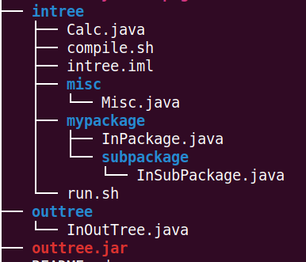

Example of package usage in Java
The file outtree.jar is not strictly necessary but for some reason I cannot add the directory outtree to vscode so I added the jar file.

The directory tree is shown below.
The main method is in class ```Calc.java```. 

To compile 

```javac -cp .:..:misc/ Calc.java```

To run

```java -cp .:..:misc/ Calc```

